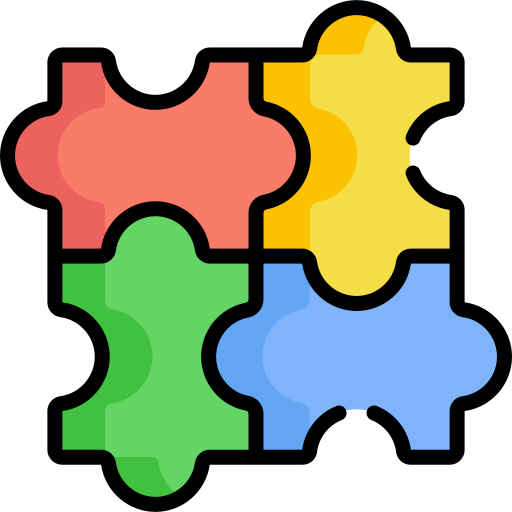
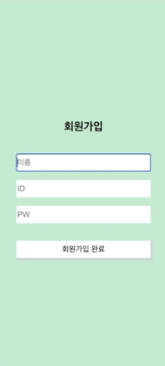

 
🏆 제 2회 코딧 X 코스 연합 해커톤 '코코톤' - 최우수상 수상작 🏆

  
  <h1>PicPuzzle</h1>

 

## 목차

1. [**대회 소개**](#1)
2. [**기획 의도 및 컨셉**](#2)
3. [**주요 기능 소개**](#3)
4. [**서비스 아키텍처**](#4)
5. [**페이지 구성**](#5)
6. [**데모 영상**](#6)
7. [**기대 효과**](#7)
8. [**개발 팀 소개**](#8)
9. [**개발 기간**](#9)

 

## 🔎 대회 소개

[제 2회 COKOTHON](https://cuboid-pipe-5a7.notion.site/2-COKOTHON-2023-4eb9005f434744fe9d0ba53e3b82c91e)은, 숙명여자대학교 인공지능공학부 학회 'CODE-IT' X 국민대학교 소프트웨어융합대학 학회 'KOSS'에서 주최하는 연합 해커톤입니다. 이번 대회의 주제는 **'추억'** 입니다.

 

## 💁🏻‍♂️ 기획 의도 및 컨셉

### 1. 추억 회상과 공유

게임을 통해 사용자들은 과거의 소중한 순간들을 회상하고 그 감정을 다시 느낄 수 있습니다.

### 2. 사용자 참여

사용자가 추억이 깃든 사진을 업로드하면 그 사진을 조각으로 섞어 메세지와 함께, 소중한 순간을 함께 한 사람에게 URL로 전달 할 수 있습니다.

### 3. 사용자 간 상호 작용 강화

URL을 받은 사용자는 퍼즐 조각을 맞추는 과정을 통해 추억을 상기시킬 수 있습니다. 이는 함께 해서 행복했던 순간들을 다시 떠올리며 감정적으로 연결되는 특별한 경험을 제공합니다.

 

## 💡 주요 기능 소개

### 1. 개인화된 퍼즐 생성

사용자가 추억이 담긴 사진을 첨부하면, 해당 사진은 자동으로 퍼즐 조각으로 분해되고 이 퍼즐은 URL의 형태로 공유할 수 있습니다.

### 2. 메세지 전달

퍼즐을 완성하고 나면 발신자가 보낸 특별한 메세지가 나타나며, 공유된 추억들이 완전한 이야기로 완성됩니다.

 

## 🛠 서비스 아키텍쳐

 

## 🗂️ 페이지 구성

 

## 🎥 데모 영상

|                                         회원 가입                                         |                                         로그인                                         |
| :---------------------------------------------------------------------------------------: | :------------------------------------------------------------------------------------: |
|  |  |

|                                         퍼즐 만들기                                         |                                         퍼즐 맞추기                                         |
| :-----------------------------------------------------------------------------------------: | :-----------------------------------------------------------------------------------------: |
|  |  |

 

## 🌟 기대 효과

### 1. 게임을 하며 추억을 되새기는 1석 2조 효과

퍼즐 조각을 맞추며 사진을 완성하는 게임을 즐기면서, 사진의 세세한 부분까지 살피며 조각을 맞춰가는 경험을 즐길 수 있습니다.

### 2. 이미지 & 테스트 모두 강조

사용자는 퍼즐을 맞추며 각 조각에 해당하는 추억을 메모하고 공유할 수 있으며, 퍼즐을 모두 맞추면 추억 관련 메세지가 출력되어 텍스트까지 강조됩니다.

### 3. 그림 우월성 효과

이미지가 텍스트보다 더 기억되기 쉬운 현상을 의미합니다. 이미지를 사용하면 기억력이 더 강화되고, 정보가 더 잘 인식되며, 장기 기억에 더 오래 남습니다.

### 4. 정보 부호화 효과

사람은 어떤 것을 인지할때 시각과 의미 부호화를 거치는데, 이미지와 텍스트를 통해서 인지하는 정보 부호화를 적용할 수 있습니다.

 

## 👪 개발 팀 소개

<table >
  <tr align="center">
    <td width="150px">
      
    </td>
    <td width="150px">
      
    </td>
    <td width="150px">
      
    </td>
    <td width="150px">
      
    </td>
    <td width="150px">
      
    </td>
  </tr>

  <tr align="center">
    <td>
      <a href="https://github.com/kmu20203059" target="_blank">
        도승준 (국민대학교)
      </a>
    </td>
    <td>
      <a href="https://github.com/misung-dev" target="_blank">
        류미성 (숙명여자대학교)
      </a>
    </td>
    <td align="center">
      <a href="https://github.com/cheesecrust" target="_blank">
        정연수 (국민대학교)
      </a>
    </td>
    <td>
      <a href="" target="_blank">
        최세연 (숙명여자대학교)
      </a>
    </td>
    <td>
      <a href="https://github.com/sukjuhong" target="_blank">
        홍석주 (국민대학교)
      </a>
    </td>
  </tr>

  <tr align="center">
    <td>
      
Front-end

    </td>
    <td>
        
Front-end

    </td>
    <td>
        
Back-end
 
    </td>
    <td>
     
Front-end

    </td>
    <td>
       
Back-end & 팀장

    </td>
  </tr>  
  
</table>

 

## 📅 개발 기간

2023년 12월 26일 ~ 2023년 12월 27일 (2일)
